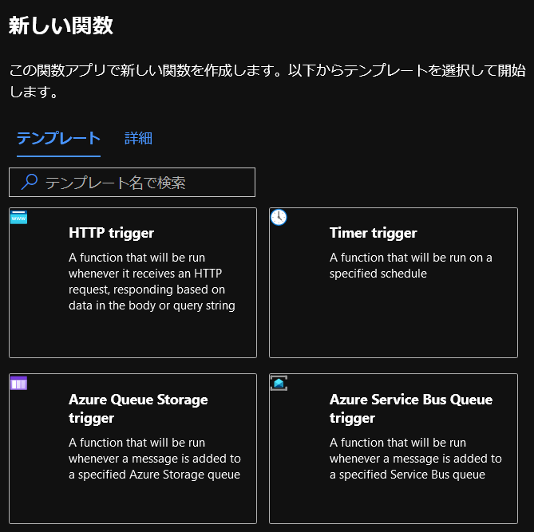

# LearnWebhookTest

https://docs.microsoft.com/ja-jp/learn/modules/monitor-github-events-with-a-function-triggered-by-a-webhook/

## 特記事項

関数の新規作成時のタイプは webhook + API は存在しないので、HTTP trigger を選択してください。  
  

